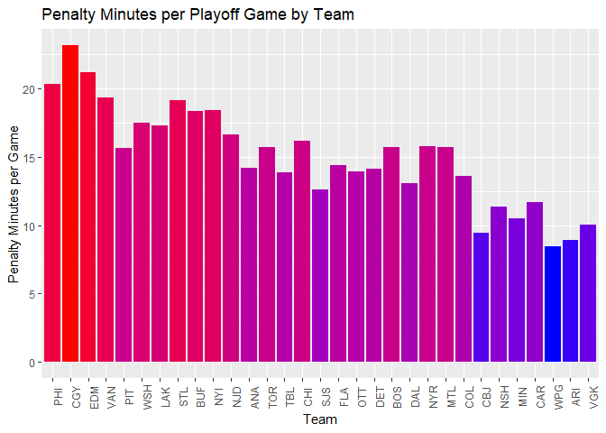
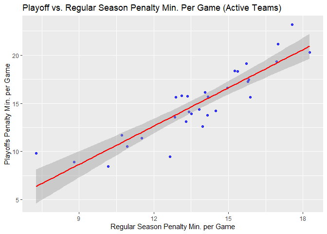
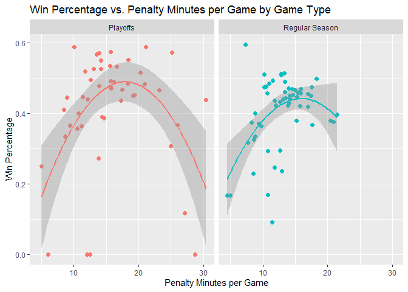

Interacting with APIs: Example with the NHL API
================
John Clements
6/15/2021

-   [Requirements](#requirements)
-   [API Interaction Functions](#api-interaction-functions)
    -   [`convertToNumeric`](#converttonumeric)
    -   [`franchise`](#franchise)
    -   [`teamTotals`](#teamtotals)
    -   [`findId`](#findid)
    -   [`seasonRecords`](#seasonrecords)
    -   [`goalieRecords`](#goalierecords)
    -   [`skaterRecords`](#skaterrecords)
    -   [`franchiseDetail`](#franchisedetail)
    -   [`seasonStats`](#seasonstats)
    -   [`nhlAPI`](#nhlapi)
-   [Data Exploration](#data-exploration)
-   [Wrap-Up](#wrap-up)

This document is a vignette to show how to retrieve data from an
[API](https://en.wikipedia.org/wiki/API). To demonstrate, I’ll be
interacting with the NHL API. I’m going to build a few functions to
interact with some of the endpoints and explore some of the data I can
retrieve.

As a note, some of these functions return data at a team level. Some of
the APIs use the franchise ID number, while some use the most recent
team ID to select a specific team’s endpoint. For that reason, if you
use any of my functions I recommend supplying a full team name
(e.g. `"Montréal Canadiens"`). My functions will decode them to the
appropriate ID number.

# Requirements

To use the functions for interacting with the NHL API, I used the
following packages:

-   [`tidyverse`](https://www.tidyverse.org/): tons of useful features
    for data manipulation and visualization
-   [`jsonlite`](https://cran.r-project.org/web/packages/jsonlite/): API
    interaction

In addition to those packages, I used the following packages in the rest
of the document:

-   [`cowplot`](https://cran.r-project.org/web/packages/cowplot/index.html):
    extra functionality for `ggplot2`
-   [`imager`](https://cran.r-project.org/web/packages/imager/): loading
    in images
-   [`broom`](https://cran.r-project.org/web/packages/broom/vignettes/broom.html):
    tidying up a regression output for display
-   [`knitr`](https://cran.r-project.org/web/packages/knitr/index.html):
    displaying tables

``` r
# Load in the packages.
library(tidyverse)
library(jsonlite)
library(cowplot)
library(imager)
library(broom)
```

# API Interaction Functions

Here is where I define the functions to interact with the [NHL Records
API](https://gitlab.com/dword4/nhlapi/-/blob/master/records-api.md) and
the [NHL Stats
API](https://gitlab.com/dword4/nhlapi/-/blob/master/stats-api.md), as
well as some helper functions.

## `convertToNumeric`

I made this helper function to convert columns that contain numeric data
stored as `character` values to numeric data types. I ran into an issue
where my calls from the API were returning some numeric data as
`character` data and needed a way to deal with this issue without just
calling `as.numeric` as needed.

``` r
convertToNumeric <- function(vec){
  ###
  # This function will convert the input vector to a numeric vector if it is 
  # able to. Otherwise, it just returns the vector.
  ###
  
  # If any of the values in vec return NA when trying to convert to numeric,
  # set output to the unchanged input.
  if (any(is.na(suppressWarnings(as.numeric(vec))) == TRUE)){
    output <- vec
  }
  # Otherwise, convert vec to a numeric vector.
  else {
    output <- as.numeric(vec)
  }
  # Return output.
  return(output)
}
```

## `franchise`

I wrote this function to interact with the `franchise` endpoint of the
NHL Records API. It returns a `data.frame` containing the franchise and
current team Id numbers, the name and abbreviations of teams, and their
first and last seasons. It takes one argument; `team`, which can either
be `"all"`, the full name of a team (e.g. `"New Jersey Devils"`), or the
**most recent team Id** (e.g. `1` for the New Jersey Devils).

``` r
franchise <- function(team="all"){
  ###
  # This functions returns a data.frame with metadata on NHL teams. It can also
  # return those columns for a single team if a team ID or name is passed.
  ###
  
  # Get the franchise data from the franchises endpoint.
  outputAPI <- fromJSON(
      "https://records.nhl.com/site/api/franchise"
      )
  
  # Select only the data.frame from the JSON output.
  output <- outputAPI$data
  
  # If team does not equal "all", check if it is a franchise ID or team name.
  if (team != "all"){
    
    # If team is in the id column, subset output for just that row.
    if (team %in% output$id){
      output <- output %>%
        filter(mostRecentTeamId == team)
    }
    # If team is in the fullName column, subset output for just that row.
    else if (team %in% output$fullName){
      output <- output %>%
        filter(fullName == team)
    }
    # Otherwise, throw an informative error.
    else {
      message <- paste("ERROR: Argument for team was not found in either",
                       "the fullName or id columns. Try franchise('all') to",
                       "find the team you're looking for.")
      stop(message)
    }
  }
  # Do nothing if the team value equals "all".
  else {
    
  }
  
  # Convert any columns that should be numeric to numeric, while suppressing
  # messages.
  output <- suppressMessages(as.data.frame(lapply(output, convertToNumeric)))
  
  # Return the output data.frame.
  return(output)
}
```

## `teamTotals`

I wrote this function to interact with the `franchise-team-totals`
endpoint of the NHL Records API. It returns a large number of statistics
for the entire history of a team for both regular season and playoff
games. It takes one argument; `team`, which can either be `"all"`, the
full name of a team (e.g. `"New Jersey Devils"`), or the **most recent
team Id** (e.g. `1` for the New Jersey Devils).

``` r
teamTotals <- function(team="all"){
  ###
  # This function returns total stats for every franchise (ex roadTies,
  # roadWins, etc) unless a specific team Id or full team name is passed. Then
  # it returns that data for the specific team. The output is a data.frame.
  ###
  
  # Get the franchise data from the franchises endpoint.
  outputAPI <- fromJSON(
    "https://records.nhl.com/site/api/franchise-team-totals"
    )
  
  # Select only the data.frame from the JSON output.
  output <- outputAPI$data
  
  # If team does not equal "all", check if it is a team ID or team name.
  if (team != "all"){
    
    # If team is in the teamId column, subset output for just that row.
    if (team %in% output$teamId){
      output <- output %>%
        filter(teamId == team)
    }
    # If team is in the teamName column, subset output for just that row.
    else if (team %in% output$teamName){
      output <- output %>%
        filter(teamName == team)
    }
    # Otherwise, warn the user and return the entire dataframe.
    else {
      message <- paste("WARNING: Argument for team was not found in either",
                       "the teamName or franchiseId columns. Returning all",
                       "franchises.")
      warning(message)
    }
  }
  # Do nothing if the team value equals "all".
  else {
  }
  
  # Convert any columns that should be numeric to numeric values.
  output <- suppressMessages(as.data.frame(lapply(output, convertToNumeric)))
  
  # Return the output data.frame.
  return(output)
}
```

## `findId`

This is a helper function to look up the most recent team Id or
franchise Id for a full team name (e.g. `findId("Boston Bruins", "team"`
or `findId("Boston Bruins", "franchise"`). It is used to find the
appropriate Id number for a API endpoint.

``` r
findId <- function(teamName, idType){
  
  # Call the franchise function with the team name so we can look up the 
  # appropriate Id from it.
  franchiseData <- franchise(teamName)
  
  # Retrieve the franchise Id if that is what the idType is.
  if (idType == "franchise"){
    output <- franchiseData$id
  }
  # Retrieve the most recent team Id if that is what the idType is.
  else if (idType == "team"){
    output <- franchiseData$mostRecentTeamId
  }
  # Any other argument throws an error.
  else {
    stop("ERROR: Invalid idType argument! Should be 'franchise' or 'team'!")
  }
  # Return the appropriate Id.
  return(output)
}
```

## `seasonRecords`

The `seasonRecords` function returns the records stats for a single
team. For example, the most goals scored in a season and the season they
scored it in. It takes one argument; `team`, which can either be the
full name of a team (e.g. `"New Jersey Devils"`), or the **franchise
Id** (e.g. `23` for the New Jersey Devils).

``` r
seasonRecords <- function(team){
  ###
  # This functions returns a data.frame with the season records for a variety 
  # of stats for a single team.
  ###
  
  # If team is a "character" type, try to look up the franchise id.
  if (typeof(team) == "character"){
    teamId = findId(team, "franchise")
  }
  # If team is an integer, set teamId equal to team.
  else if ((typeof(team) == "double") & (team %% 1 == 0)){
    teamId = team
  }
  # Otherwise, throw an error.
  else {
    message <- paste("ERROR: Please pass a franchise id (integer) or a full",
                     "team name (e.g. 'Boston Bruins').")
    stop(message)
  }
  
  # Set the base url, endpoint, and combine them with teamId for the full url.
  baseURL <- "https://records.nhl.com/site/api/"
  endpoint <- "franchise-season-records?cayenneExp=franchiseId="
  fullURL <- paste0(baseURL, endpoint, teamId)
  
  # Get the API output.
  outputAPI <- fromJSON(fullURL)
  # Select only the data from the API output.
  output <- outputAPI$data
  
  # Convert any columns that should be numeric to numeric format.
  output <- suppressMessages(as.data.frame(lapply(output, convertToNumeric)))
  
  # Return the output from the request.
  return(output)
}
```

## `goalieRecords`

The `goalieRecords` function returns the stats for all the goalies
who’ve played for a single team. For example, the most saves in a game
and the date of the game. It takes one argument; `team`, which can
either be the full name of a team (e.g. `"New Jersey Devils"`), or the
**franchise Id** (e.g. `23` for the New Jersey Devils).

``` r
goalieRecords <- function(team){
  ###
  # This functions returns a data.frame with the goalie records for a team.
  ###
  
  # If team is a "character" type, try to look up the franchise id.
  if (typeof(team) == "character"){
    teamId = findId(team, "franchise")
  }
  # If team is an integer, set teamId equal to team.
  else if ((typeof(team) == "double") & (team %% 1 == 0)){
    teamId = team
  }
  # Otherwise, throw an error.
  else {
    message <- paste("ERROR: Please pass a franchise id (integer) or a full",
                     "team name (e.g. 'Boston Bruins').")
    stop(message)
  }
  
  # Set the base url, endpoint, and combine them with teamId for the full url.
  baseURL <- "https://records.nhl.com/site/api/"
  endpoint <- "franchise-goalie-records?cayenneExp=franchiseId="
  fullURL <- paste0(baseURL, endpoint, teamId)
  
  # Get the API output.
  outputAPI <- fromJSON(fullURL)
  # Select only the data from the JSON output.
  output <- outputAPI$data
  
  # Convert any columns that should be numeric to numeric format.
  output <- suppressMessages(as.data.frame(lapply(output, convertToNumeric)))
  
  # Return the output from the request.
  return(output)
}
```

## `skaterRecords`

The `skaterRecords` function returns the stats for all the non-goalie
players who’ve played for a single team. For example, the most penalty
minutes they received in one season and the season the season it
occurred in. It takes one argument; `team`, which can either be the full
name of a team (e.g. `"New Jersey Devils"`), or the **franchise Id**
(e.g. `23` for the New Jersey Devils).

``` r
skaterRecords <- function(team){
  ###
  # This functions returns a data.frame with the skater records for a team.
  ###
  
  # If team is a "character" type, try to look up the franchise id.
  if (typeof(team) == "character"){
    teamId = findId(team, "franchise")
  }
  # If team is an integer, set teamId equal to team.
  else if ((typeof(team) == "double") & (team %% 1 == 0)){
    teamId = team
  }
  # Otherwise, throw an error.
  else {
    message <- paste("ERROR: Please pass a franchise id (integer) or a full",
                     "team name (e.g. 'Boston Bruins').")
    stop(message)
  }
  
  # Set the base url, endpoint, and combine them with teamId for the full url.
  baseURL <- "https://records.nhl.com/site/api/"
  endpoint <- "franchise-skater-records?cayenneExp=franchiseId="
  fullURL <- paste0(baseURL, endpoint, teamId)
  
  # Get the API output.
  outputAPI <- fromJSON(fullURL)
  # Select only the data from the JSON output.
  output <- outputAPI$data
  
  # Convert any columns that should be numeric to numeric format.
  output <- suppressMessages(as.data.frame(lapply(output, convertToNumeric)))
  
  # Return the output from the request.
  return(output)
}
```

## `franchiseDetail`

This function gets info for a franchise, like their retired numbers. It
takes one argument; `team`, which can either be the full name of a team
(e.g. `"New Jersey Devils"`), or the **most recent team Id** (e.g. `1`
for the New Jersey Devils).

``` r
franchiseDetail <- function(team){
  ###
  # This functions returns a data.frame with the data for a team.
  ###
  
  # If team is a "character" type, try to look up the team id.
  if (typeof(team) == "character"){
    teamId = findId(team, "team")
  }
  # If team is an integer, set teamId equal to team.
  else if ((typeof(team) == "double") & (team %% 1 == 0)){
    teamId = team
  }
  # Otherwise, throw an error.
  else {
    message <- paste("ERROR: Please pass a team id (integer) or a full",
                     "team name (e.g. 'Boston Bruins').")
    stop(message)
  }
  
  # Set the base url, endpoint, and combine them with teamId for the full url.
  baseURL <- "https://records.nhl.com/site/api/"
  endpoint <- "franchise-detail?cayenneExp=mostRecentTeamId="
  fullURL <- paste0(baseURL, endpoint, teamId)
  
  # Get the API output.
  outputAPI <- fromJSON(fullURL)
  # Select only the data from the JSON output.
  output <- outputAPI$data
  
  # Convert any columns that should be numeric to numeric format.
  output <- suppressMessages(as.data.frame(lapply(output, convertToNumeric)))
  
  # Return the output from the request.
  return(output)
}
```

## `seasonStats`

This function returns a `data.frame` containing stats for the current
season. It takes one argument; `team`, which can either be `"all"`, the
full name of a team (e.g. `"New Jersey Devils"`), or the **most recent
team Id** (e.g. `1` for the New Jersey Devils).

``` r
seasonStats <- function(team="all", raw=FALSE){
  ###
  # Returns the current seasons stats for all teams or just one. If raw is 
  # FALSE, it returns only the stats. If raw is TRUE, it just returns the API
  # output for the user to parse.
  ###
  
  # If raw is not a valid input, throw an error.
  if ((raw != TRUE) & (raw != FALSE)){
    stop("ERROR: Argument for raw must equal TRUE or FALSE!")
  }
  # Otherwise do nothing.
  else {
    
  }
  
  # If team equals "all" the spot where ID goes in the URL will be blank.
  if (team == "all"){
    teamId = ""
  }
  # If team is a "character" type, try to look up the team id.
  else if (typeof(team) == "character"){
    teamId = findId(team, "team")
  }
  # If team is an integer, set teamId equal to team.
  else if ((typeof(team) == "double") & (team %% 1 == 0)){
    teamId = team
  }
  # Otherwise, throw an error.
  else {
    message <- paste("ERROR: Please pass a team id (integer) or a full",
                     "team name (e.g. 'Boston Bruins').")
    stop(message)
  }
  
  # Paste together the endpoint URL from its components.
  baseURL <- "https://statsapi.web.nhl.com/api/v1/teams/"
  modifier <- "?expand=team.stats"
  fullURL <- paste0(baseURL, teamId, modifier)
  # Get the data from the endpoint.
  outputAPI <- fromJSON(fullURL, flatten=TRUE)
  
  # If the user doesn't want every team's data, execute this chunk.
  if (team != "all"){
    
    # If raw is FALSE, give back only the stats.
    if (raw == FALSE){
      # Navigate through the columns and list indices to select the stats only.
      teamStats <- outputAPI$teams$teamStats[[1]]$splits[[1]][1,]
      # Convert any columns that should be numeric to numeric.
      teamStats <- suppressMessages(as.data.frame(lapply(teamStats,
                                                         convertToNumeric)))
    }
    # If the user wants the raw API output, give it to them so they can parse
    # it themselves.
    else {
      teamStats <- outputAPI$teams
    }
  }
  # Otherwise, return them the data for all teams.
  else {
    
    # If raw is FALSE, give back only the stats.
    if (raw == FALSE){
      
      # Get the teamStats list where each element is a data.frame.
      output <- outputAPI$teams$teamStats
      # Count the number of teams. The last element is NULL.
      num_teams = length(output) - 1
      # Make a variable to hold just the stats, starting with the first team.
      teamStats <- output[[1]]$splits[[1]][1,]
      
      # Loop through the 2nd to the last team in the list.
      for (i in seq(2, num_teams)){
        # Select only the first row of the seasons stats for the team.
        stats <- output[[i]]$splits[[1]][1,]
        # Add the row to teamStats.
        teamStats <- rbind(teamStats, stats)
      }
    # Convert any columns that should be numeric to numeric format.
    teamStats <- suppressMessages(as.data.frame(lapply(teamStats,
                                                       convertToNumeric)))
    }
    # If the user wants the raw API output, give it to them so they can parse 
    # it themselves.
    else {
      teamStats <- outputAPI$teams
    }
  }
  
  # Return teamStats.
  return(teamStats)
}
```

## `nhlAPI`

This function is a wrapper function for all the others above. You simply
pass the name of the function you want to use, like `"seasonStats`, and
any additional arguments for that function.

``` r
nhlAPI <- function(func, ...){
  ###
  # This function is a wrapper for the other functions. It takes in the name
  # of the function to use as a character and any additional arguments for that
  # function.
  ###
  
  # Find and call the appropriate function using conditional logic.
  
  if (func == "franchise"){
    output <- franchise(...)
  }
  else if (func == "teamTotals"){
    output <- teamTotals(...)
  }
  else if (func == "seasonRecords"){
    output <- seasonRecords(...)
  }
  else if (func == "goalieRecords"){
    output <- goalieRecords(...)
  }
  else if (func == "skaterRecords"){
    output <- skaterRecords(...)
  }
  else if (func == "franchiseDetail"){
    output <- franchiseDetail(...)
  }
  else if (func == "seasonStats"){
    output <- seasonStats(...)
  }
  else {
    stop("ERROR: Argument for func is not valid!")
  }
  
  # Return the output from the appropriate function.
  return(output)
}
```

# Data Exploration

Now that we can interact with a few of the endpoints of the NHL API,
let’s get some data from them.

First, let’s pull current season stats for all teams by calling
`nhlAPI("seasonStats")`.

``` r
# Get the current season stats for all of the teams in the NHL.
currentSeason <- nhlAPI("seasonStats")
```

Two variables of interest to me are shots per game and shooting
percentage. I’m interested in how these two stats relate to a team’s win
percentage. This variable doesn’t exist, so I need to calculate it. I
define this as the number of wins divided by the total number of games
played.

``` r
# Add a column for the win percentage.
currentSeason <- currentSeason %>%
  mutate(winPercentage = stat.wins / stat.gamesPlayed)
```

My guess is these two are positively related to the win percentage. A
high shooting percentage means you are fairly likely to score when you
shoot. A high number of shots per game likely means you are controlling
the puck more than the other team and you have more scoring
opportunities, unless you’re taking wild shots. Both stats seem like
great proxies for offensive power.

<!-- -->

Below I plotted the win percentage against shots per game and shooting
percentage. I added a regression line as well. As expected, both are
positively related to the win percentage.

``` r
# Create a scatter plot of win pct vs. shots per game.
plot1 <- ggplot(currentSeason, aes(stat.shotsPerGame,
                                   winPercentage,
                                   color=winPercentage)) + 
  # Add a scatter plot layer and adjust the size and opaqueness of points.
  geom_point(size=4, alpha=0.75) + 
  # Add a color gradient for winPercentage.
  scale_color_gradient(low="blue", high="red") + 
  # Remove the legend because it takes up space.
  theme(legend.position="none") + 
  # Add a black regression line.
  geom_smooth(method=lm, formula=y~x, color="black") + 
  # Add labels to the axes.
  scale_x_continuous("Shots per Game") + 
  scale_y_continuous("Win Percentage") + 
  # Add a title.
  ggtitle("Win Pct. vs. Shots per Game")

# Create a scatter plot of win pct vs. shooting pct.
plot2 <- ggplot(currentSeason, aes(stat.shootingPctg,
                                   winPercentage,
                                   color=winPercentage)) + 
  # Add a scatter plot layer and adjust the size and opaqueness of points.
  geom_point(size=4, alpha=0.75) + 
  # Add a color gradient for winPercentage.
  scale_color_gradient(low="blue", high="red") + 
  # Remove the legend because it takes up space.
  theme(legend.position="none") + 
  # Add a black regression line.
  geom_smooth(method=lm, formula=y~x, color="black") + 
  # Add labels to the axes.
  scale_x_continuous("Shooting Percentage") + 
  scale_y_continuous("Win Percentage") + 
  # Add a title.
  ggtitle("Win Pct. vs. Shooting Pct.")

# Plot them side-by-side.
plot_grid(plot1, plot2, ncol=2)
```

<!-- -->

Now let’s look at shooting percentage vs. shots per game. I added a
color gradient for the win percentage.

``` r
# Create a scatter plot of shooting pct vs. shots per game.
plot3 <- ggplot(currentSeason, aes(stat.shotsPerGame,
                                   stat.shootingPctg,
                                   color=winPercentage)) + 
  # Add a scatter plot layer and adjust the size and opaqueness of points.
  geom_point(size=4, alpha=0.75) + 
  # Add a color gradient for winPercentage with an improved label.
  scale_color_gradient(low="blue", high="red", name="Win Pct.") + 
  # Add labels to the axes.
  scale_x_continuous("Shots per Game") + 
  scale_y_continuous("Shooting Percentage") + 
  # Add a title.
  ggtitle("Shooting Pct. vs. Shots per Game") 

# Show the plot.
plot3
```

<!-- -->

There doesn’t appear to be a clear relationship between those two
variables, which I thought there might be. Some interesting finds, but
none unexpected.

Now let’s look at some stats for the total history of all teams. I
called `nhlAPI("teamTotals")` to get this data.

``` r
# Get some stats for the total history of a team.
teamTotalStats <- nhlAPI("teamTotals")
```

First, let’s look at the number of inactive vs. active teams.

``` r
teamStatus <- teamTotalStats %>%
  # Filter for regular season stats.
  filter(gameTypeId == 2) %>%
  # Create a column that tells whether a team is active or not.
  mutate(currentlyActive = ifelse(is.na(lastSeasonId), 
                                  "Active", "Inactive")) %>%
  # Select the teamName and activity status columns.
  select(teamName, currentlyActive)

# Count the number of active and inactive teams.
numActive <- sum(teamStatus =="Active")
numInactive <- sum(teamStatus =="Inactive")
```

There are 26 inactive and 31 active teams. Almost as many teams have
left the NHL than are currently still playing.

Not all the teams have been around for the same length of time and I
want to adjust some stats to be able to compare teams on the same basis.
I’m particularly interested in the penalty minutes and records of the
teams.

To get numbers on the same basis when the number of games played are so
different, I’m calculating the the penalty minutes per game as total
penalty minutes divided by the total games played. I again calculate the
win percentage as the number of wins divided by the number of games
played.

I’m also interested in how a game being a playoff or regular season game
affects penalty minutes because I think the importance of a playoff game
might cause changes in the penalty behavior.

In addition, I created a column, `recordType` that indicates if a team
has a winning or losing record. They are classified as having a winning
record if $0.5 &lt; \\frac{\\text{Wins}}{\\text{Games Played}}$ and a
losing record if $0.5 \\geq \\frac{\\text{Wins}}{\\text{Games Played}}$.

``` r
teamTotalStats <- teamTotalStats %>%
  # Add columns for penalty minutes per game, win percentage, a text
  # representation of the game type, and whether a team has a losing or winning
  # record for the game type.
  mutate(penaltyMinutesPerGame = penaltyMinutes / gamesPlayed,
         winPercentage = wins / gamesPlayed,
         gameType = ifelse(gameTypeId == 2, "Regular Season", "Playoffs"),
         recordType = ifelse(wins > losses, "Winning Record", "Losing Record"))
```

Below is a table showing the count of active teams with losing and
winning records by game type.

``` r
# Filter for active teams by looking for missing values in lastSeasonId.
activeTeams <- teamTotalStats %>%
  filter((is.na(lastSeasonId) == TRUE))

# Display a table of the game types by record types for active teams.
knitr::kable(table(activeTeams$gameType, activeTeams$recordType),
             caption=paste("Counts of Franchise Record Types by Game Type",
                           "for Active Franchises"))
```

|                | Losing Record | Winning Record |
|:---------------|--------------:|---------------:|
| Playoffs       |            18 |             13 |
| Regular Season |             4 |             27 |

Counts of Franchise Record Types by Game Type for Active Franchises

Below is the same table for inactive teams. It’s clear from these tables
that the inactive teams were much worse than the teams that are still
active. They probably had a difficult time bringing in an audience and
selling merchandise because they were so bad. That is likely why they
are no longer around.

``` r
# Filter for only inactive teams by looking for rows where lastSeasonId is not
# missing.
inactiveTeams <- teamTotalStats %>%
  filter((is.na(lastSeasonId) == FALSE))

# Count the number of inactive teams using the number of teams with regular
# season games.
numInactiveTeams <- dim(filter(inactiveTeams, gameTypeId == 2))[1]

# Count the number of inactive teams that made it to the playoffs, which is not
# all of the inactive teams.
numInactiveTeamsInPlayoffs <- dim(filter(inactiveTeams, gameTypeId == 3))[1]

# Count the number of inactive teams who did not make the playoffs.
numDidntMakePlayoffs <- numInactiveTeams - numInactiveTeamsInPlayoffs

# Create an index for the last row in inactive teams.
currentEndRow <- nrow(inactiveTeams)

# Add as many empty rows to inactiveTeams as teams not making the playoffs.
inactiveTeams[currentEndRow+seq(numDidntMakePlayoffs),] <- NA

# Teams without playoff data do not have rows for that game type. I'm going to
# add the proper number of losing records to the dataframe to account for the
# missing rows for the playoffs.
inactiveTeams[currentEndRow+seq(numDidntMakePlayoffs), 
              "recordType"] <- "Losing Record"

# To make the table work, I need to make the gameType of these rows "Playoffs".
inactiveTeams[currentEndRow+seq(numDidntMakePlayoffs), 
              "gameType"] <- "Playoffs"

# Display a table of the game types by record types for inactive teams.
knitr::kable(table(inactiveTeams$gameType, inactiveTeams$recordType),
             caption=paste("Counts of Franchise Record Types by Game Type",
                           "for Inactive Franchises"))
```

|                | Losing Record | Winning Record |
|:---------------|--------------:|---------------:|
| Playoffs       |            24 |              2 |
| Regular Season |            22 |              4 |

Counts of Franchise Record Types by Game Type for Inactive Franchises

For now, I will keep both inactive and active teams in the data set. Now
let’s get a numerical summary of the win percentage by the game type.

``` r
# Create a table of summary stats for win percentage by game type.
winPercSumm <- teamTotalStats %>% 
  # Select the gameType and winPercentage columns.
  select(gameType, winPercentage) %>%
  # Group by game type.
  group_by(gameType) %>%
  # Get summary statistics for winPercentage.
  summarize("Min." = min(winPercentage),
            "1st Quartile" = quantile(winPercentage, 0.25, na.rm=TRUE),
            "Median" = quantile(winPercentage, 0.5, na.rm=TRUE),
            "Mean" = mean(winPercentage, na.rm=TRUE),
            "3rd Quartile" = quantile(winPercentage, 0.75, na.rm=TRUE),
            "Max" = max(winPercentage),
            "Std. Dev." = sd(winPercentage, na.rm=TRUE)
            )

# Display a table of the summary stats.
knitr::kable(winPercSumm, 
             caption="Summary Statistics for win percentage by game type",
             digits=2)
```

| gameType       | Min. | 1st Quartile | Median | Mean | 3rd Quartile |  Max | Std. Dev. |
|:---------------|-----:|-------------:|-------:|-----:|-------------:|-----:|----------:|
| Playoffs       | 0.00 |         0.37 |   0.46 | 0.42 |         0.52 | 0.59 |      0.16 |
| Regular Season | 0.09 |         0.37 |   0.44 | 0.40 |         0.47 | 0.59 |      0.10 |

Summary Statistics for win percentage by game type

Based on the summary stats, the distributions don’t seem very different,
although win percentages in the playoffs might be more variable. There
is at least one franchise that never won a playoff game. Let’s visualize
the distributions with box plots.

``` r
# Make a box plot of franchise win percentage by game type.
plot4 <- ggplot(teamTotalStats, 
               aes(gameType,
                   winPercentage,
                   color=gameType)) +
  # Add the box plot layer.
  geom_boxplot() + 
  # Jitter the points to add a little more info to the boxplot.
  geom_jitter() + 
  # Add labels to the axes.
  scale_x_discrete("Game Type") + 
  scale_y_continuous("Win Percentage") +
  # Add a title.
  ggtitle("Franchise Win Percentage by Game Type") + 
  # Remove the legend because it isn't needed.
  theme(legend.position="none")

# Display the plot.
plot4
```

<!-- -->

There is definitely a difference in spread in win percentage between
playoff and regular season games. Even if they are close in central
tendency, regular season win percentages are more tightly distributed.
This is likely due to there being more regular season games than playoff
games.

Now let’s look at a numeric summary of per game penalty minutes by game
type. Playoff games seem to have a higher central tendency and be more
variable in the penalty minutes per game.

``` r
# Create a table of summary stats for penalty minutes per game by game type.
penMinSumm <- teamTotalStats %>% 
  # Select the gameType and penaltyMinutesPerGame columns.
  select(gameType, penaltyMinutesPerGame) %>%
  # Group by game type.
  group_by(gameType) %>%
  # Get summary statistics for penaltyMinutesPerGame.
  summarize("Min." = min(penaltyMinutesPerGame),
            "1st Quartile" = quantile(penaltyMinutesPerGame, 0.25),
            "Median" = quantile(penaltyMinutesPerGame, 0.5),
            "Mean" = mean(penaltyMinutesPerGame),
            "3rd Quartile" = quantile(penaltyMinutesPerGame, 0.75),
            "Max" = max(penaltyMinutesPerGame),
            "Std. Dev." = sd(penaltyMinutesPerGame)
            )

# Display a table of the summary stats.
knitr::kable(penMinSumm, 
             caption=paste("Summary Statistics for Penalty Minutes per",
                           "Game by Game Type"),
             digits=2)
```

| gameType       | Min. | 1st Quartile | Median |  Mean | 3rd Quartile |   Max | Std. Dev. |
|:---------------|-----:|-------------:|-------:|------:|-------------:|------:|----------:|
| Playoffs       |  5.0 |        11.92 |  14.52 | 15.74 |        18.56 | 30.42 |      5.81 |
| Regular Season |  4.5 |        10.72 |  13.13 | 13.00 |        15.26 | 21.51 |      3.64 |

Summary Statistics for Penalty Minutes per Game by Game Type

The histogram below provides an alternative to the box plot for
visualizing the distribution of a penalty minutes per game. It’s clear
the penalty minutes per playoff game has a right tail stretching beyond
regular season games.

``` r
# Make a histogram of penalty minutes per game by game type.
plot5 <- ggplot(teamTotalStats,aes(penaltyMinutesPerGame, y=..density..,
                                   fill=gameType)) + 
  # Add a semi-transparent histogram with 10 bins for regular season games.
  geom_histogram(data=subset(teamTotalStats,gameType == 'Regular Season'),
                 bins=10, alpha = 0.5) +
  # Add a semi-transparent histogram with 10 bins for playoff games.
  geom_histogram(data=subset(teamTotalStats,gameType == 'Playoffs'),
                 bins=10, alpha = 0.5) + 
  # Add a better legend label.
  guides(fill=guide_legend(title="Game Type")) +
  # Add labels to the axes.
  scale_x_continuous("Penalty Minutes per Game") + 
  scale_y_continuous("Density") +
  # Add a title.
  ggtitle("Histogram of Penalty Minutes per Game by Game Type")

# Display the plot.
plot5
```

<!-- -->

I’m curious as to which teams spend the most time in the penalty box per
game. I filtered for active teams and regular season games and made a
bar chart for each team and their penalty minutes per game. I sorted the
bars in the bar chart from worst behaved to best behaved.

``` r
# Create a column with the triCode for each team ordered by most penalty 
# time per game to least.
mostPenaltyMinsRegSeason <- teamTotalStats %>%
  # Filter for active teams and regular season games.
  filter(is.na(lastSeasonId) & (gameTypeId == 2)) %>%
  # Sort from most penalty minutes per game to the least.
  arrange(desc(penaltyMinutesPerGame)) %>%
  # select the triCode column.
  select(triCode)

# Create a bar chart for the penalty mins per regular season game by active 
# teams.
plot6 <- teamTotalStats %>%
  # Filter for active teams and their regular season stats.
  filter(is.na(lastSeasonId) & (gameTypeId == 2)) %>%
  # Create a column that is a sorted factor of triCode.
  mutate(sortedTriCode = factor(triCode,
                                levels=mostPenaltyMinsRegSeason[["triCode"]],
                                ordered=TRUE))  %>%
  # Create a bar chart with a fill gradient for penaltyMinutesPerGame.
  ggplot(aes(sortedTriCode, penaltyMinutesPerGame, 
             fill=penaltyMinutesPerGame)) +
  geom_col() + 
  # Rotate the x-axis labls 90 degrees and remove the legend.
  theme(axis.text.x=element_text(angle=90), legend.position="none") +
  # Change the fill gradient to go from blue to red.
  scale_fill_gradient(low="blue", high="red") +
  # Set the axes labels.
  scale_x_discrete("Team") + 
  scale_y_continuous("Penalty Minutes per Game") +
  # Add a title.
  ggtitle("Penalty Minutes per Regular Season Game by Team")

# Display the plot.
plot6
```

<!-- -->

It seems the Philly Fliers are as rowdy as Philly sports fans. I
produced the same bar plot again, but this time for playoff games. I
kept the ordering of most rowdy in the regular season. If there is a
correlation between penalties in the regular season and in the playoffs,
we will expect the order to not change much.

``` r
# Create a bar chart for the penalty mins per playoff game by active 
# teams.
plot7 <- teamTotalStats %>%
  # Filter for active teams and their playoff stats.
  filter(is.na(lastSeasonId) & (gameTypeId == 3)) %>%
  # Create a column that is a sorted factor of triCode.
  mutate(sortedTriCode = factor(triCode,
                                levels=mostPenaltyMinsRegSeason[["triCode"]],
                                ordered=TRUE))  %>%
  # Create a bar chart with a fill gradient for penaltyMinutesPerGame.
  ggplot(aes(sortedTriCode, penaltyMinutesPerGame, 
             fill=penaltyMinutesPerGame)) +
  geom_col() + 
  # Rotate the x-axis labls 90 degrees and remove the legend.
  theme(axis.text.x=element_text(angle=90), legend.position="none") +
  # Change the fill gradient to go from blue to red.
  scale_fill_gradient(low="blue", high="red") +
  # Set the axes labels.
  scale_x_discrete("Team") + 
  scale_y_continuous("Penalty Minutes per Game") +
  # Add a title.
  ggtitle("Penalty Minutes per Playoff Game by Team")

# Display the plot.
plot7
```

<!-- -->

The order did not change much, so there is a correlation between regular
season penalty time and playoff penalty time. Let’s look at a scatter
plot between penalty minutes per game in the playoffs vs. the regular
season.

``` r
# Create a scatter plot of playoff penalty time per game vs. regular season.
plot8 <- teamTotalStats %>%
  # Filter for active teams.
  filter(is.na(lastSeasonId)) %>%
  # Select triCode, gameType, and penaltyMinutesPer Game.
  select(triCode, gameType, penaltyMinutesPerGame) %>%
  # Spread penaltyMinutesPerGame by gameType.
  spread(gameType, penaltyMinutesPerGame) %>%
  # Create a scatter plot with a regression line.
  ggplot(aes(`Regular Season`, Playoffs)) +
  # Add a scatter plot layer and adjust the size and opaqueness of points.
  geom_point(alpha=0.75,  color="blue") + 
  # Add a red regression line.
  geom_smooth(method=lm, formula=y~x, color="red") +
  # Set the axes labels.
  scale_x_continuous("Regular Season Penalty Min. per Game") +
  scale_y_continuous("Playoffs Penalty Min. per Game") + 
  # Add a title.
  ggtitle("Playoff vs. Regular Season Penalty Min. Per Game (Active Teams)")

# Display the plot.
plot8
```

<!-- -->

Although the positive correlation is not very surprising, I did not
expect the correlation to be that tight.

I wonder how penalty minutes per game relates to the win percentage.
Let’s find out!

I created a scatter plot for the win percentage vs the penalty minutes
per game by game type. I experimented with the regression lines a
little. I first started with a
[LOESS](https://en.wikipedia.org/wiki/Local_regression) regression line
and saw an upside-down U pattern to the lines. I decided to plot them
with a quadratic regression line to make things smoother.

``` r
plot9 <- teamTotalStats %>%
  # Select the triCode, gameType, penaltyMinutesPerGame, and winPercentage
  # columns.
  select(triCode, gameType, penaltyMinutesPerGame, winPercentage) %>%
  # Create a scatter plot of winPercentage vs. penaltyMinutesPerGame, coloring
  # by game type.
  ggplot(aes(penaltyMinutesPerGame, winPercentage, color=gameType)) +
  # Add a scatter plot layer and adjust the size.
  geom_point(size=2) + 
  # Add a quadratic regression line.
  geom_smooth(method="lm", formula="y~poly(x, 2)") + 
  # Set the axes labels.
  scale_x_continuous("Penalty Minutes per Game") + 
  scale_y_continuous("Win Percentage") + 
  # The legend isn't needed, so remove it.
  theme(legend.position="none") + 
  # Add a title
  ggtitle("Win Percentage vs. Penalty Minutes per Game by Game Type") + 
  # Break out the plots by game type.
  facet_wrap(~gameType)

# Display the plot.
plot9
```

<!-- -->

As you can see, the relationship between the win percentage and penalty
minutes per game is not exactly tidy, but there does seem to be a
quadratic relationship there. In regular season games, it seems like 15
minutes is an optimal amount of time to be in the penalty box with
regards to the win percentage. For playoff games, it appears to be in
the ballpark of 17 minutes.

I do not know much about hockey, but it seems like there is a strategy
to taking penalties, even if it gives the other team a power play
opportunity. Let’s test for the quadratic relationship a little more
formally with a regression.

``` r
# Create a model regressing win percentage on penalty minutes per game.
winPercMod <- lm(winPercentage ~ poly(penaltyMinutesPerGame, 2),
                 data=teamTotalStats)

# Get the percentage of variance explained.
winVarExplainedPerc <- round(100*summary(winPercMod)[[8]],1)

# Create a table of the regression coefficients.
tidywinPercModSumm <- winPercMod %>%
  # Pass the model through the tidy() function.
  tidy()

# Rename the variables for improved printing.
tidywinPercModSumm[1, "term"] = "Intercept"
tidywinPercModSumm[2, "term"] = "Penalty Min. per Game"
tidywinPercModSumm[3, "term"] = "(Penalty Min. per Game)^2"

# Pass the tidied model output to a table and format it.
knitr::kable(
  tidywinPercModSumm,
  caption=paste("Coefficient summary of Win Perc. Regressed on",
                "Penalty Min. per Game with Quadratic Term"),
  col.names = c("Variable", "Est. Coef.", "SE", "t", "P(|t| > 0)"),
  digits=c(0, 2, 3, 2, 3)
)
```

| Variable                  | Est. Coef. |    SE |     t | P(\|t\| &gt; 0) |
|:--------------------------|-----------:|------:|------:|----------------:|
| Intercept                 |       0.41 | 0.011 | 36.65 |           0.000 |
| Penalty Min. per Game     |       0.20 | 0.114 |  1.74 |           0.085 |
| (Penalty Min. per Game)^2 |      -0.62 | 0.114 | -5.39 |           0.000 |

Coefficient summary of Win Perc. Regressed on Penalty Min. per Game with
Quadratic Term

Given the t-statistics for the quadratic term in the regression, a
quadratic relationship appears reasonable. This model explains 23.9% of
the variance in win percentage, so there is still a fair amount of
variance you would want to account for in a predictive model. Still,
this is an interesting find!

# Wrap-Up

To summarize everything I did in this vignette, I built functions to
interact with some of the NHL API’s endpoints, retrieved some of the
data, and explored it using tables, numerical summaries, and data
visualization. I found some unsurprising things, like shots per game and
shooting percentage are related to win percentage. I also found some
surprising things, namely penalty minutes per game has a quadratic
relationship with win percentage.

Most importantly, I hope my code helps you with interacting with APIs!
